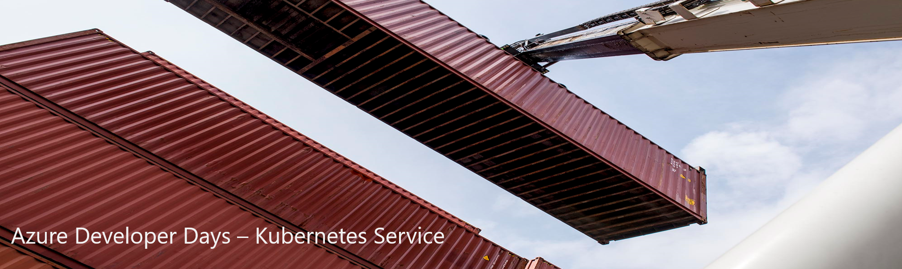
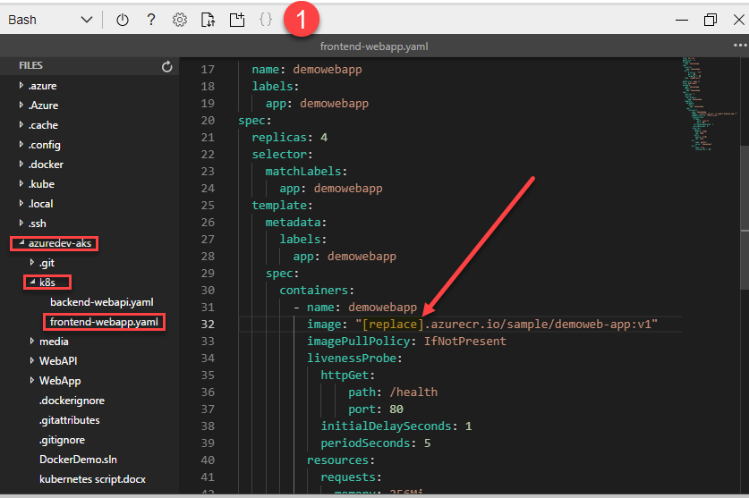
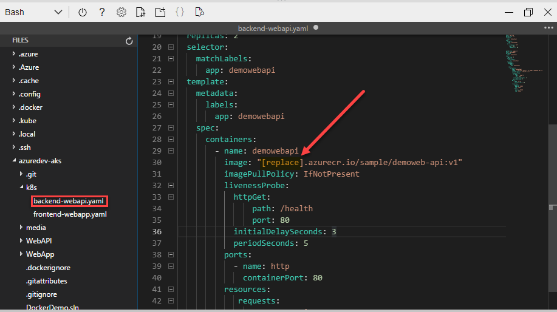

# Azure Developer Days Lab - Azure Kubernetes Service (AKS)
>Duration 45 minutes

# Table of contents 


**Objectives**

This lab provides walkthroughs on various Kubernetes topics:  

  - Creating an Azure Container Registry
  - Creating an AKS cluster linked to a Container Registry
  - Creating Docker images
  - Deploying a Microservice application to AKS

[reference](https://docs.microsoft.com/en-us/azure/container-registry/container-registry-quickstart-task-cli)

Log into Azure

Launch Azure Cloud Shell 

Create ACR

Create AKS liked to ACR

create docker images

---
## Task 1: Login to Azure Cloud Shell
In this exercise you log into your Azure Subscription and launch the Bash [Azure Cloud Shell](https://docs.microsoft.com/en-us/azure/cloud-shell/overview). The Azure Cloud Shell will give you a Linux shell prompt with all the required software installed and configured.  

1. [Launch Cloud Shell](https://shell.azure.com)  (https://shell.azure.com)
1. When prompted, Log into your Azure Subscription 
1. If this is your first time launching the Azure Cloud Shell, you will need to create a storage account. 

    1. Choose Bash shell

         
    
    1. Create Cloud Storage
    
            


> Use ***shift+insert*** to paste the commands from this lab into the cloud shell terminal

## Task 2: Create a Container Registry 

1. First, create a unique name for the container registry 
```bash
acr="azdevdaysacr"$RANDOM
echo $acr
```


1. Create a Resource Group to organize the resources we will create in the Lab.  An Azure resource group is a logical container into which Azure resources are deployed and managed.

```bash
az group create -n azuredevdays-rg --location eastus
```

2. Next, create an Azure container registry in the Resource Group we created in the previous step.

```bash 
az acr create -g azuredevdays-rg --n $acr --sku Basic
```

## Task 3 - Create an Azure Kubernetes Cluster 

1. Create an AKS Cluster and link it to the Container Registry created in Exercise 2

```bash 
az aks create \
    -n azuredevdays-aks \
    -g azuredevdays-rg \
    --generate-ssh-keys \
    --attach-acr $acr \
    --node-count 1
```
> This can take several minutes to complete 


## Task 4 - Build and Push images

1. Download repository 

```bash
git clone https://github.com/RandyPatterson/azuredev-aks.git
cd azuredev-aks
```

2. Build the Web App front-end image and upload to Container Registry
```bash
az acr build \
    --image sample/demoweb-app:v1 \
    --registry $acr \
    --file ./WebApp/Dockerfile .
```

3. Build the API back-end image and upload to the container registry created in 
```bash
az acr build \
    --image sample/demoweb-api:v1 \
    --registry $acr \
    --file ./WebAPI/Dockerfile .
```
## Task 5 - Deploy application to AKS

1. First, modify the Kubernetes YAML files to include the name of your Azure Container Registry created in [Task 2](#task-2-create-a-container-registry). You can type the command ``` echo $acr ``` to display the name of your Registry

    1. Open the editor using the ```{}``` icon located at the top of Azure Cloud Shell
    1. In the editor, navigate to the direcory **azuredev-aks/k8s** and open the **frontend-webapp.yaml** file and update the string **"[replace]"** for the container image name on line 32 with the name of your container registry 
    1. Save your changes by pressing ```CTRL+S```
    

    1. Next, open the file **backend-webapi.yaml** and update the string **"[replace]"** for the container image name with the name of your container registry 
    


    >Challenge: Scale the front web app pods to 4 instances

    <details>
    <summary>Answer</summary>
    
    ### Scale the web app pods to 4 replicas using the command
    ```bash
    kubectl scale ......
    ```
    </details>