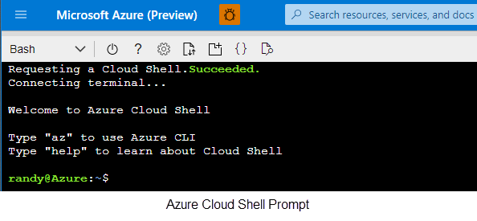

# Azure Developer Days Lab - Azure Kubernetes Service (AKS)
>Duration 45 minutes

# Table of contents 


**Objectives**

This lab provides walkthroughs on various Kubernetes topics:  

  - Creating an Azure Container Registry
  - Creating an AKS cluster linked to a Container Registry
  - Creating Docker images
  - Deploying a Microservice application to AKS

[reference](https://docs.microsoft.com/en-us/azure/container-registry/container-registry-quickstart-task-cli)

Log into Azure

Launch Azure Cloud Shell 

Create ACR

Create AKS liked to ACR

create docker images

---
## Exercise 1: Login to Azure Cloud Shell
In this exercise you log into your Azure Subscription and launch the Bash [Azure Cloud Shell](https://docs.microsoft.com/en-us/azure/cloud-shell/overview). The Azure Cloud Shell will give you a Linux shell prompt with all the required software installed and configured.  

1. [Launch Cloud Shell](https://shell.azure.com)  (https://shell.azure.com)
1. When prompted, Log into your Azure Subscription 
1. If this is you first time launching the Azure Cloud Shell, you will need to link a storage account. 

    1. Choose Bash shell
     
    1. Create Cloud Storage
        



>TIP: Use ***shift+insert*** to paste the commands from this lab into the cloud shell terminal

## Exercise 2 - Create a Container Registry 
First, create a Resource Group to organize the resources we will create in the Lab.  An Azure resource group is a logical container into which Azure resources are deployed and managed.

``` bash
az group create -n azuredevdays-rg --location eastus
```

Next, create an Azure container registry in the Resource Group we created in the previous step.

``` bash 
az acr create -g azuredevdays-rg --n azuredevdaysacr --sku Basic
```

## Exercise 3 - Create an Azure Kubernetes Cluster 
Create an AKS Cluster and link it to the Container Registry created in Exercise 2

``` bash 
az aks create -n azuredevdays-aks -g azuredevdays-rg  --generate-ssh-keys --attach-acr azuredevdaysacr --node-count 1
```
>NOTE: This will take several minutes to complete 


## Exercise 4 - Build and Push images

1. Download repository 

``` bash
git clone https://github.com/RandyPatterson/azuredev-aks.git
cd azuredev-aks
```


Build WebAPI back-end image and upload to Container Registry
``` bash
az acr build --image sample/demoweb-api:v1 --registry azuredevdaysacr --file ./WebAPI/Dockerfile .
```

Build Web App front-end image and upload to Container Registry
``` bash
az acr build --image sample/demoweb-app:v1 --registry azuredevdaysacr --file ./WebApp/Dockerfile .
```